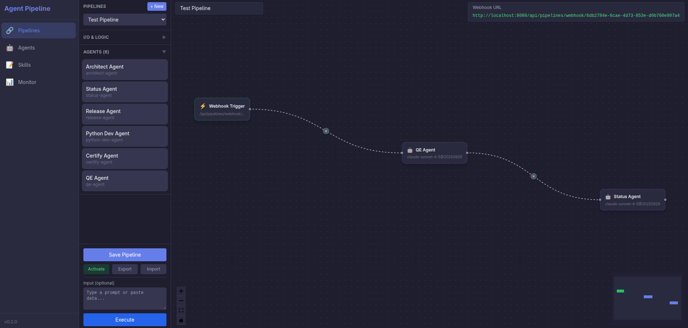

# AI Pipeline

A generic multi-agent pipeline framework powered by Claude AI via Google VertexAI. Define your agents, wire them together, and let them run autonomously.



## Getting Started

```bash
# Authenticate to VertexAI
gcloud auth application-default login

# Configure
cp .env.example .env
# Edit .env with your ANTHROPIC_VERTEX_PROJECT_ID and tokens

# Build & Run
make build
make start

# Verify
make status
```

Dashboard: http://localhost:8080

## How It Works

Agents communicate through a Redis message bus. An orchestrator coordinates the workflow — each agent receives a task, calls Claude via VertexAI, stores artifacts, and passes results to the next agent.

An example pipeline (Ansible collection development) is included under `agents/` to illustrate how to build and chain agents together.

## Make Commands

```bash
make build              # Build all images
make start              # Start all services
make stop               # Stop all services
make restart            # Restart
make logs               # View all logs
make status             # Service status
make clean              # Remove everything
make trigger-pipeline   # Start test pipeline
```

## License

GPLv2 — see [LICENSE](LICENSE)
